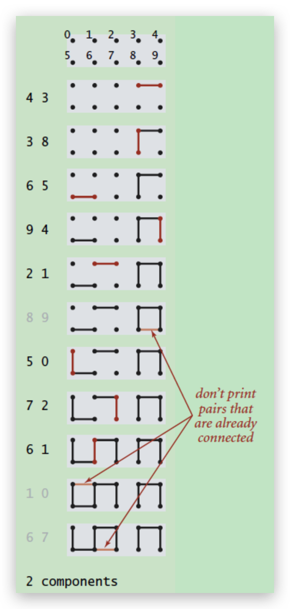
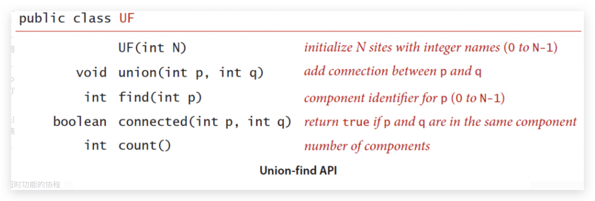
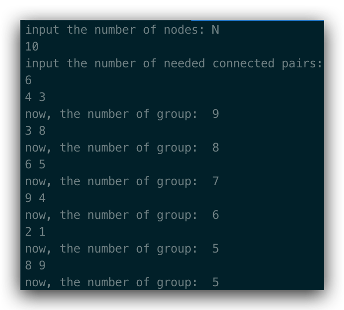
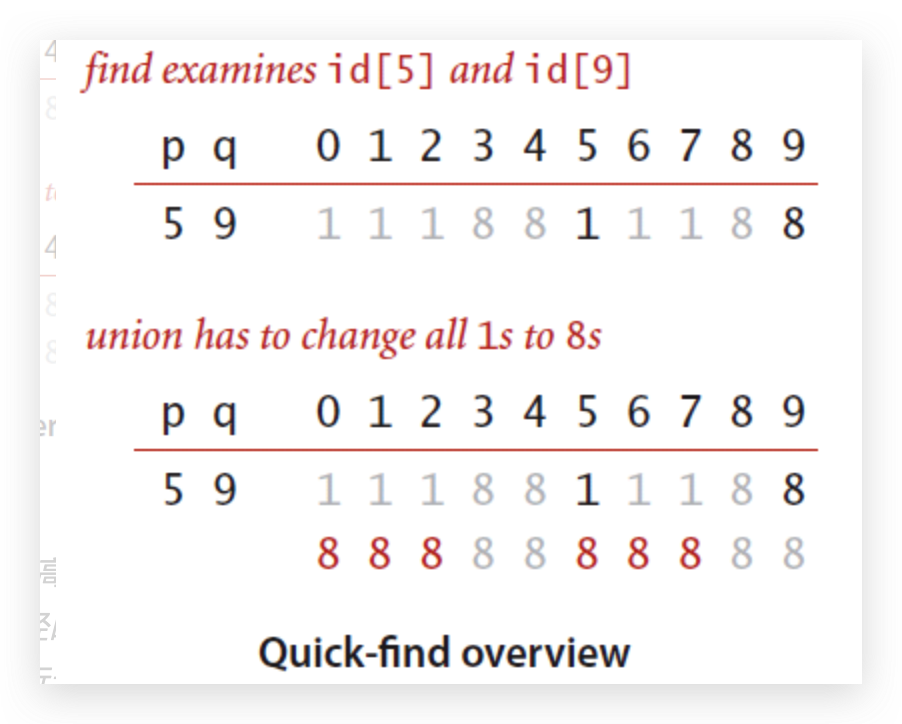
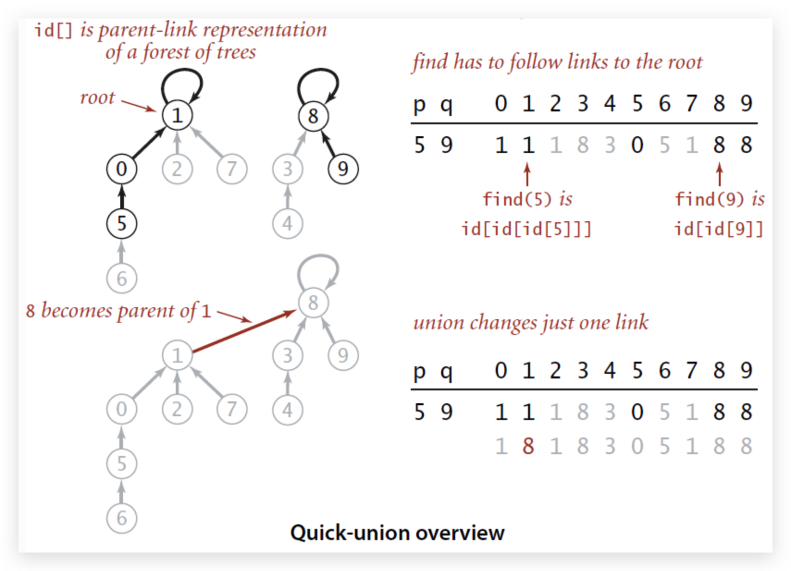
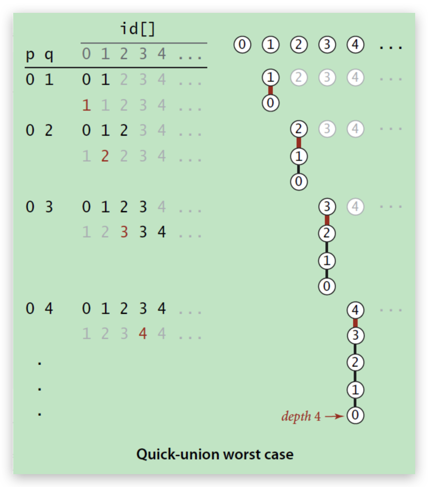
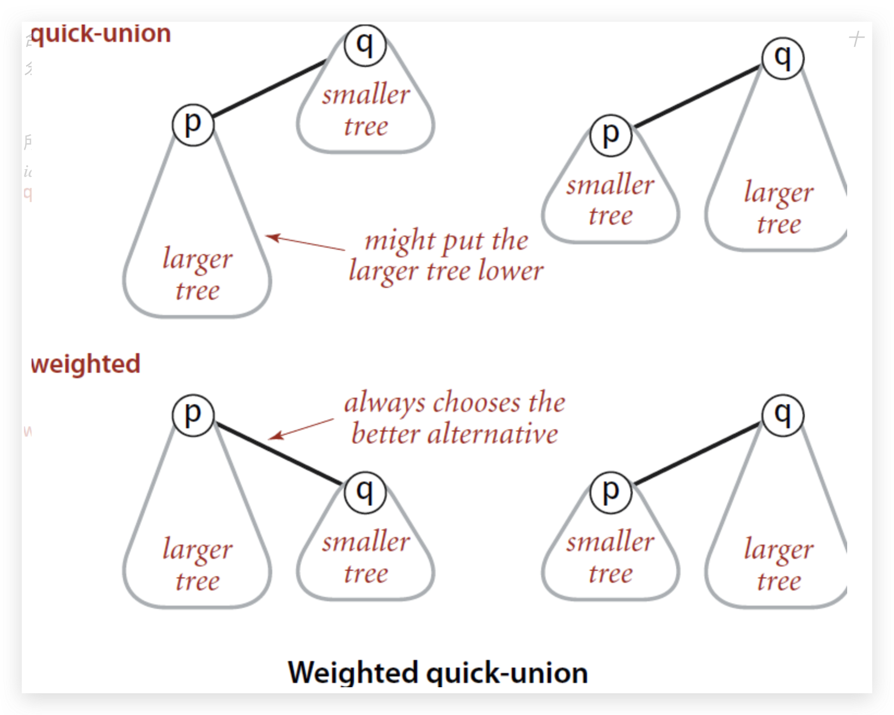
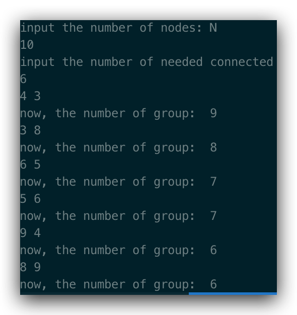
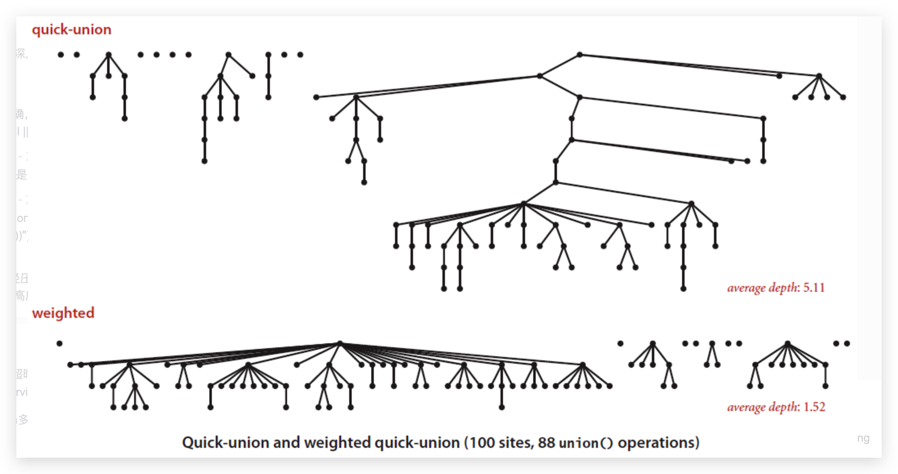

## 并查集(Union-Find)

---

### 引子

最近看到在网上有人发了一道华为的机试题目：

> ### 小孩分组
>
> 每个小孩都有想要一起组队的人如：(John, Jack)
> 输入N 和 N行上述二元组 求老师最少可以将孩子们分为多少个组


这个问题可以划分到动态连通性的一类类问题，可以使用一种叫做并查集Union-Find的数据结构。


### 动态连通性



我们将引子中题目形式化改变一下：

> 假设我们输入一组整数对，如图中所述：(4, 3), (3, 8)......，每对整数代表着两个ponits是连通的。随着数据的不断输入，整个图的连通性也在不断变化。对于已经连通的points，直接忽略，不进行处理。

#### 应用场景

- 网络连接判断

  如果每对pair中的两个整数分别代表一个网络节点，这么pair代表这两个网络节点是否需要连通。为所有的pairs建立动态的连接图后，就可以减少节点之间的布线，节约资源；

- 变量名等同性

  在程序中，可以声明多个引用指向同一个对象，这个时候就可以通过为程序中声明的引用和实际对象建立动态连接图来判断哪些引用实际指向的是同一个对象；


### 问题建模

这个主要看👀我们要解决的问题是什么？

模型中选用的算法和数据结构会随着具体问题的不同而发生变化。对于动态连通性这一类问题，可能面临的问题包括：

- 给出两个节点，判断它们是否连通；如果连通，不需要给出具体的路径
- 给出两个节点，判断它们是否连通；如果连通，给出具体的路径

就上面👆两个问题而言，仅仅在于结果的呈现方式上的不同，虽然很相似，但是却是不同的问题，因此要选用的算法也不同。

对于第一个问题，主要使用不需要给出具体路径的Union-Find算法；而对于第二个问题，则需要使用回溯算法，例如DFS。


### 建模思路

我们在看看👀第一个问题：

> 对于两个节点，判断它们是否连通；不需要给出连通路径

如何判断两个节点是否连通呢？

- 思路1⃣️：每个节点保存和它有关联的节点序列；判断两个节点是否连通，我们需要遍历之前的所有节点，判断它们的关联节点序列中是否存在对应的节点即可。这能想到的数据结构是`map<int, vector<int>>`。

  缺点就是，每次判断时间复杂度O(m1+m2)，m1, m2为两个节点关联的节点总数。如果m1, m2比较大的话，每次时间复杂度接近O(n)，效率比较低下。

  同时，map每个位置都要存一个vector，明显感觉信息冗余，为什么？因为这些节点之间相互连通，那么可以认为它们属于同一组。

  既然属于同一组，只需要保存每个节点所属的组号就行，判断两个节点是否连通这个问题就转换成了判断两个节点是否在同一组的问题。这样，我们引出思路2⃣️

- 思路2⃣️：通过判断两个节点的组号是否相同，来判断它们是否连通。当然，这需要基于连通数据预处理，形成一个动态的连通图。初始时，这些节点都是相互孤立的，分别属于不同的组，它们拥有各自唯一的组号。随着数据pair对的加入，将需要连通的两个节点所属的组进行合并，为什么？因为单个组之间的节点是相互连通的，不同的两个组之间只要有一对节点连通了，那么这两个组之间的节点就相互连通了，因此，可以形成一个更大的组。

  

为简化操作，我们只需要更改相应的组号就行，将一个组的组号更改为另一个组的组号。

初始化：

```cpp
for(int i = 0; i < size; i++) {
  id[i] = i;
}
```

所有节点以整数表示，N个节点使用0~N-1之间的整数表示。数组的index是节点的整数表示，代表一个节点，相应的值表示其所属的组的组号。

对于动态连通图，我们后续可能的操作主要有：

- 查询某个节点所属的组号

- 判断两个节点是否属于同一个组

- 新来一对pair，连接pair中的两个节点使之成为一个组；

  根据节点的编号得到它们所属的组号，如果相同，则不需要再次连通；如果不相同，则将一个节点的组号改为另一个节点的组号；

  另外，还需要找到跟这个改变组号的节点属于同一个组的其它节点，对于这些其它节点，也要改变它们的组号。

  ⚠️：对于当前的数据结构，要找到所有组号相同的其它节点，则需要遍历整个数组，即所有节点，整个时间复杂度为O(n)；

- 获取组的数目

  初始化为节点的数量，每次成功连通了两个节点，则将该值减1；

基于上述信息，构建类，API设计：



⚠️：上述用整数表示一个节点，如果需要用其它的数据类型代表节点的话，比如字符串，则可以使用`hashmap`表来进行映射，即用多余的数据结构`map`将`string`映射成`int`类型。

在API设计中，`merge`和`connected`都依赖于`find`方法，因此，需要将`find`方法设计地更为高效。😊


### 算法设计

#### 版本一

Quick-Find算法，版本1⃣️：

```cpp
class UF {
public:
  UF(int N) {
    count = N;
    id.resize(N);
    for(int i = 0; i < N; i++) {
      id[i] = i;
    }
  }
  int count() { return count;}
  bool connected(int p, int q) {
    return find(p) == find(q);
  }
  int find(int p) {return id[p];}
  void merge(int p, int q) {
    int pId = find(p), qId = find(q);
    if(pId == qId) return;
    for(int i = 0; i < N; i++) {
      if(id[i] == qId) id[i] = pId;
    }
    if(count) count--;
  }
private:
  vector<int> id;
  int count;
}
```

Output:

> 

例如，当前输入的pair为(5, 9)，要将节点5和9连通，也即合并为一个大组。首先，通过`find`查找二者并不属于同一组，于是将节点5所在的组的组号1更改为节点9的组号8，同时更改组号1的其它节点的组号值，即原先组号为1的节点，其组号全部更改为新的组号8。



**算法效率分析：**

上述代码中，`find`十分高效，因为底层数据结构是数组，因此仅用O(1)的时间复杂度就可以找到一个节点对应的组号。但是，每次在添加新路径🆕时，涉及到节点组号的更改，不仅仅修改当前pair对中的节点，还需要修改跟这个新加入修改组号的节点同组的其它节点的组号。在数组中，我们要找到这些其它节点，必然需要遍历一边已知的所有节点。假设需要新加入的路径数量为M，节点数量为N，那么所有路径添加完，最后整体的时间复杂度为O(MN)，如果M比较大，那么，对于大规模数据来说，整体的时间复杂度接近O(n^2)，效率就显得比较低下。

那么，怎么提升整体的效率呢？🤔

<font color="red">**问题的关键在于合并两个组，因此要致力于提升merge的效率，merge瓶颈在于需要遍历整个数组，有什么方法可以不用遍历整个数组就得到一个节点同一组的其它节点吗？**</font>


### Quick-Union算法

上面的问题，解决之法已经不是算法的问题， 在于数据结构，底层数组的数据结构属性使得我们必须遍历整个数组？

那么，有什么其他数据结构，在保证时间复杂度低于O(n)的情况下，可以达到我们想要的目的吗？进而我们提出两个问题：

- 查找一个节点所在组的其它所有节点，**可以达到O(logn)的复杂度**吗？如果有，什么类型的数据结构可以做到？
- 查找一个节点所在组的其它所有节点，**可以达到O(1)的复杂度吗**？如果有，什么类型的数据结构可以做到？

在不改变底层数据结构，即仍用数组的前提下，上面👆两个问题可以解决吗？

之前数组中元素之间没有组织关系，毫无规律。那么是否可以补充，建立前后节点间的关系呢？

采用parent-link的方式将节点组织起来，节点之间组织成树🌲的关系，但底层仍采用数组表示。举例，id[p]的值代表节点p的父亲节点的序号，如果p时根节点，那么id[p]的值仍为p，这个是特殊情况。经过若干次查找，一个节点总是可以找到它所在树的根节点，即当条件满足id[root]=root时，该节点就是根节点，使用根节点来表示这个节点的组号。因此，不同的🌲代表的是不同的组，那么`merge`是要将两颗不同的树合并为一颗树🌲。`find`操作则对应在一颗树上寻找该树的根节点。



版本2⃣️：

根据上面👆叙述，我们只需要更改`find`和`merge`方法就行。

```cpp
//quick_union.h
#include<vector>

class UF {
public:
  UF(int N) {
    cnt = N;
    id.resize(N);
    for(int i = 0; i < N; i++) {
      id[i] = i;
    }
  }
  int count() { return cnt;}
  bool connected(int p, int q) {
    return find(p) == find(q);
  }
  int find(int p) {
    // 寻找p节点所在的根节点
    // 根节点的特点是id[p]=p
    while(p != id[p]) p = id[p];
    return p;
  }
  void merge(int p, int q) {
    int pRoot = find(p), qRoot = find(q);
    if(pRoot == qRoot) return;
    // 将树qRoot的父节点设置为pRoot
    // 两颗树合并为一颗
    id[pRoot] = qRoot;
    if(cnt) cnt--;
  }
private:
  std::vector<int> id;
  int cnt;
};
```


**算法效率分析**：

树🌲这种数据结构的特点决定了它容易受数据分布的影响，比如数据是否是有序的，是否是随机分布等。如果数据是有序的，那么构造的BST会退化成一个链表。

对于这个问题，下图是一个极端的例子：



BST树中，我们可以通过红黑树或者AVL树来解决这个问题，保持树的平衡。

那么，在这个场景中，合并两颗树，节点之间并不具备比较，我们也没有进行节点的比较。那么，有什么办法可以在建树的过程中，让构建的树尽量保持两端平衡呢？

```cpp
void merge(int p, int q) {
  int pRoot = find(p);
  int qRoot = find(q);
  if(pRoot == qRoot) return;
  id[pRoot] = qRoot;
  cnt--;
}
```

回顾之前的`merge`实现，我们发现在合并树🌲的过程中`id[pRoot]=qRoot`，我们始终按照一个规则来合并树，这是一种硬编码，并没有考虑两颗本身的大小关系。这种合并树的方式并不合理，如果pRoot代表的树要比qRoot的树大很多的话，每次这么合并，最终合并的树就会长成畸形树，类似长长的链表形状。

所以，我们应该在合并树前，考虑二者的大小，然后来决定到底如何合并：`id[pRoot]=qRToot`还是`id[qRoot]=pRoot`。



*即总是**size**小的树作为子树和**size**大的树进行合并。这样就能够尽量的保持整棵树的平衡。*

因此，我们修改`merge`方法，得到版本3⃣️：为了在`merge`时得到两颗树的大小，显然我们应该在建树的过程中保存各个根节点所代表树的大小：即节点的个数。初始时，所有的树大小为1。明显，我们应该新增一个数组`sz`专门用于保存此信息。

Quick-union-v2:

```cpp
//quick_union_v2.h
#include<vector>

class UF {
public:
  UF(int N) {
    cnt = N;
    id.resize(N);
    sz.resize(N);
    for(int i = 0; i < N; i++) {
      id[i] = i;
      sz[i] = 1;
    }
  }
  int count() { return cnt;}
  bool connected(int p, int q) {
    return find(p) == find(q);
  }
  int find(int p) {
    // 寻找p节点所在的根节点
    // 根节点的特点是id[p]=p
    while(p != id[p]) p = id[p];
    return p;
  }
  void merge(int p, int q) {
    int pRoot = find(p), qRoot = find(q);
    if(pRoot == qRoot) return;
    // 将树qRoot的父节点设置为pRoot
    // 两颗树合并为一颗, 将小树最为子树，即pRoot子树的根节点为qRoot
    if(sz[pRoot] < sz[qRoot]) {
      id[pRoot] = qRoot;
      sz[qRoot] += sz[pRoot];
    }
    else {
      id[qRoot] = pRoot;
      sz[pRoot] += sz[qRoot];
    }
    if(cnt) cnt--;
  }
private:
  std::vector<int> id;
  std::vector<int> sz;
  int cnt;
};
```

output:



*Quick-Union* *和* *Weighted Quick-Union* *的比较：*



**算法效率分析：**

通过sz数组来决定如何合并两颗树后，最后得到的树🌲的高度也大大减小了。<font color="red">这有什么意义呢？</font>

merge过程需要先调用find找到根节点，树的高度降低，find搜索达到根节点的路径变短了，因此时间复杂度也下降了，提高了效率。

更进一步分析，上述分析给我们启示，节点组织好后的结构形态应该是一颗尽量平衡扁平型的树🌲。扁平性质可以保证从叶子节点搜索根节点路径变短，<font color="yellow">那么问题来了，最短的路径可以达到多少？可以达到最短的1吗？</font>🤔


### 进阶-路径压缩

如何让路径更短呢？围绕这个问题，我们进行继续探索🤔

在`find`方法中，我们需要while循环♻️来找到根节点，那么在查找的过程中能否把中间节点保存起来，在找到根节点后，将这些中间节点的父节点都指向根节点。

但是，这个方法也有弊端。为什么？🤔，因为`find`操作非常频繁，会频繁造成生成中间节点数组，相应的分配销毁时间上升🔝。

如何改进呢？🤔->

<font color="yellow">**将节点的父节点指向该节点的爷爷节点，即跳过一个节点。**</font>这种方法很巧妙，结果会使得整颗树🌲更加扁平化了。

思考：🤔为什么只跳过一个节点？可不可以跳过两个节点？

```cpp
int find(int p) {
  while(p != id[p]) {
    id[p] = id[id[p]];
    p = id[p];
  }
  return p;
}
```


### 总结

---


以上介绍的几种算法时间复杂度比较如下表⬇️：按照层层递进的关系

|Algorithm|Constructor| Merge | Find|
|:---:|:----:|:----:|:---:|
|**Quick-Find**|N|N|1|
|**Quick-Union**|N|Tree height|Tree height|
|**Weighted Quick-Union**|N|lgN|lgN|
|**Weighted Quick-Union With Compression**|N|very near to 1(amortized)|Very near to 1(amortized)|


**注意**⚠️：

如果不仅需要检测两个节点是否连通，还需要得到连通时具体的路径，那么这时就需要用到回溯算法：DFS，BFS了，这又是下一个专题🧱。

